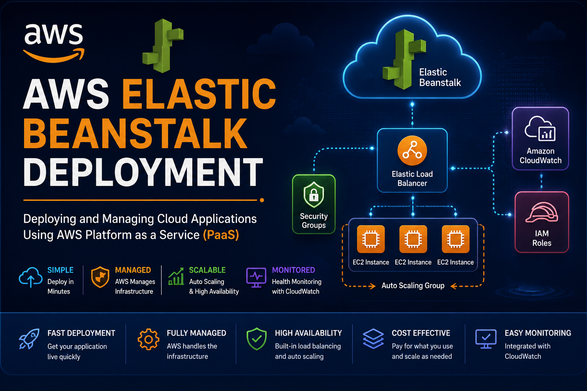
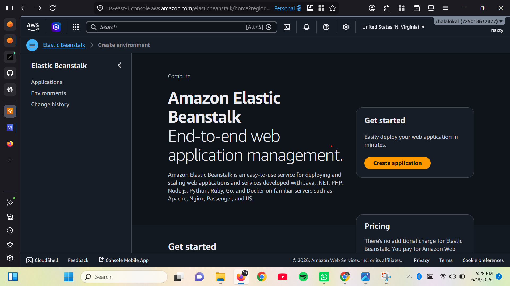
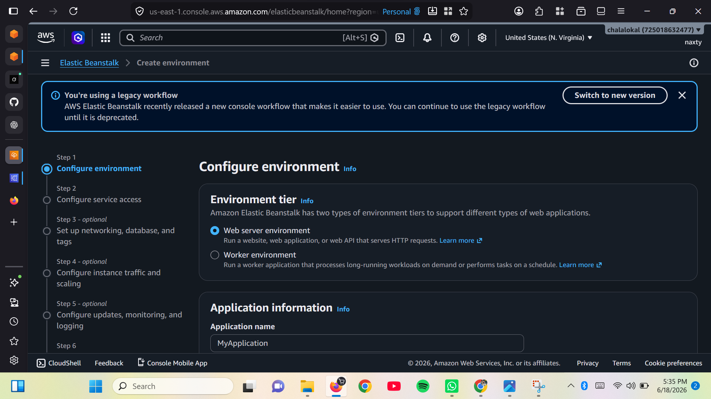
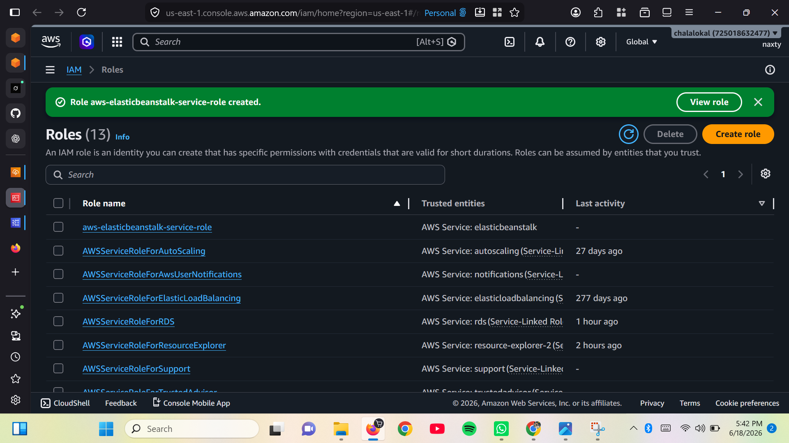
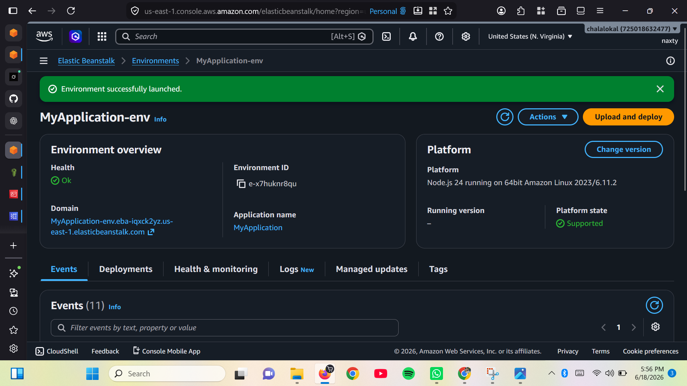
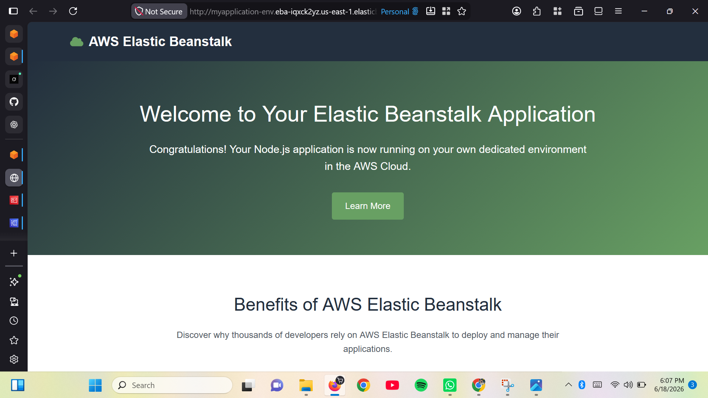
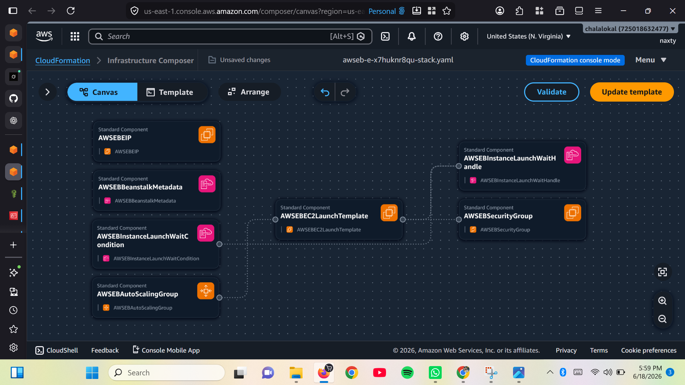

# AWS Elastic Beanstalk Deployment

<p align="center">
    
</p>
---

##  Project Overview

Amazon Elastic Beanstalk is a Platform as a Service (PaaS) that simplifies the deployment and management of web applications. In this project, an application environment was created using Elastic Beanstalk, AWS automatically provisioned the required infrastructure, and the deployed application was successfully accessed through the generated environment URL.

---

## 🏗 Project Architecture


```
User
  ↓
Browser (HTTP Request)
  ↓
AWS Elastic Beanstalk
  ↓
EC2 Instance (Auto-provisioned)
  ↓
Application (Node.js / Python / etc.)
  ↓
CloudWatch Monitoring
```

---

##  Project Objectives

- Deploy a web application using AWS Elastic Beanstalk
- Automatically provision cloud infrastructure
- Launch an application environment
- Understand the relationship between Elastic Beanstalk and supporting AWS services
- Access the deployed application using the generated environment URL

---

##  AWS Services Used

- Elastic Beanstalk
- EC2
- Elastic Load Balancer
- Auto Scaling
- IAM
- Security Groups
- CloudWatch

---

##  Prerequisites

- AWS Account
- IAM User
- AWS Management Console
- Sample Web Application

---

# Step 1 — Open Elastic Beanstalk Console

Navigate to the AWS Management Console and search for **Elastic Beanstalk**.

From the dashboard, choose **Create Application** to begin deploying a managed application environment.


<p align="center">
    
</p>

---

# Step 2 — Create Application Environment

Provide the application name.

Choose:

- Web Server Environment
- Platform
- Application Code

Configure the deployment settings and continue through the wizard.

AWS prepares all required resources automatically.

<p align="center">
    
</p>

---

# Step 3 — Configure Service Roles

Elastic Beanstalk automatically creates the required IAM Service Role and EC2 Instance Profile.

These roles allow Elastic Beanstalk to:

- Launch EC2 instances
- Configure networking
- Create Load Balancers
- Monitor application health
- Communicate with CloudWatch


<p align="center">
    
</p>

---

# Step 4 — Launch Environment

After reviewing the configuration, choose **Create Environment**.

Elastic Beanstalk automatically provisions:

- EC2 Instance
- Security Groups
- Auto Scaling Group
- Elastic Load Balancer
- CloudWatch Monitoring

Deployment usually takes several minutes.


<p align="center">
    
</p>

---

# Step 5 — Verify Deployment

After deployment completes, Elastic Beanstalk reports the environment health as **Green (Healthy)**.

AWS generates a public application URL.

Open the URL in a browser to verify that the application is running successfully.

The default sample application displays:

> Congratulations! You have successfully launched your application using AWS Elastic Beanstalk.


<p align="center">
    
</p>

---

# Step 6 — Review Infrastructure Composer

Elastic Beanstalk automatically created all supporting AWS infrastructure.

Using the Infrastructure Composer view, the following resources can be observed:

- Elastic Beanstalk Environment
- EC2 Instance
- Security Groups
- Load Balancer
- IAM Roles
- Auto Scaling Components
- Networking Configuration

This visualization demonstrates how Elastic Beanstalk orchestrates multiple AWS services into a single managed application platform.


<p align="center">
    
</p>

---

#  Project Outcome

Successfully deployed a web application using AWS Elastic Beanstalk.

Verified that:

- Infrastructure was automatically provisioned.
- The application became publicly accessible.
- AWS managed the underlying compute resources.
- Supporting services were automatically integrated.

---

#  Skills Demonstrated

- AWS Elastic Beanstalk
- Platform as a Service (PaaS)
- Application Deployment
- Infrastructure Automation
- EC2 Management
- Load Balancing
- IAM Roles
- Security Groups
- Cloud Infrastructure
- Cloud Monitoring

---

#  Note

To avoid unnecessary AWS charges:

1. Terminate the Elastic Beanstalk Environment.
2. Delete the Application.
3. Verify all EC2 resources have been removed.
4. Confirm the Load Balancer has been deleted.

---

#  Lessons Learned

This project demonstrated how AWS Elastic Beanstalk abstracts infrastructure management while still provisioning enterprise-grade AWS services such as EC2, Elastic Load Balancing, IAM, Security Groups, and Auto Scaling. It highlighted the advantages of using a managed platform to simplify application deployment, allowing developers to focus on writing code rather than manually configuring infrastructure.

---

## Author

Elochukwu Princewill

Cloud Computing • Cybersecurity 
